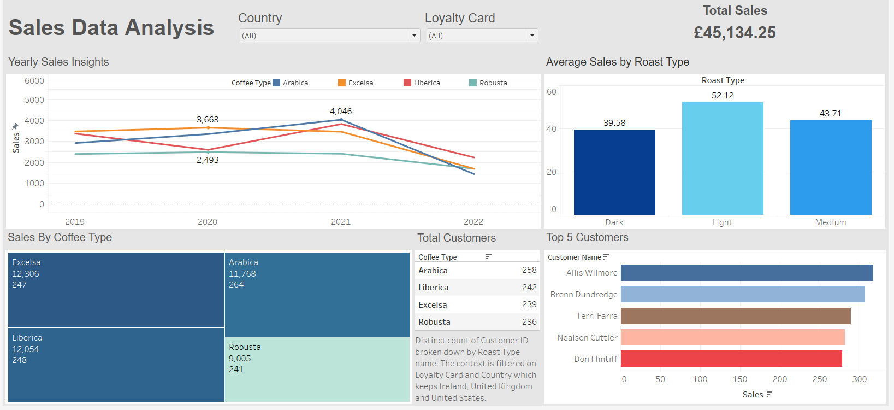

# Coffee Bean Sales Analysis and Visualization

This repository contains the analysis and visualizations of Coffee Bean Sales Data using Tableau.

## Project Overview

This project involves cleaning and modifying data in Excel, joining two tables, and preparing the data for import into Tableau. I created worksheets to filter and analyze coffee sales data, identifying key sales patterns, including trends by year and type. The results are presented through various Tableau visualizations, incorporating factors such as countries and other relevant criteria as well.

## Files Included

- `Raw_Coffee_Sales_Data.xlsx`: The original raw data file.
  
- `Formatted_Coffee_Sales_Data.xlsx`: The modified and formatted data used in Tableau. Cleaned and streamlined the Excel data, applying various formulas and consolidating sheets using functions like XLOOKUP. Proceeded with the ETL process to prepare the data for import into Tableau.

- `Analysis_and_Visualization_of_Coffee_Sales.twbx`: The Tableau workbook includes multiple visualizations and a dashboard.
  

## Tableau Dashboard

Explore the interactive Tableau dashboard online at [Coffee Sales _Tableau_Dashboard](https://public.tableau.com/app/profile/keerthi.kankanala/viz/TableauSalesDataAnalysis_17226254164510/Dashboard3?publish=yes).

